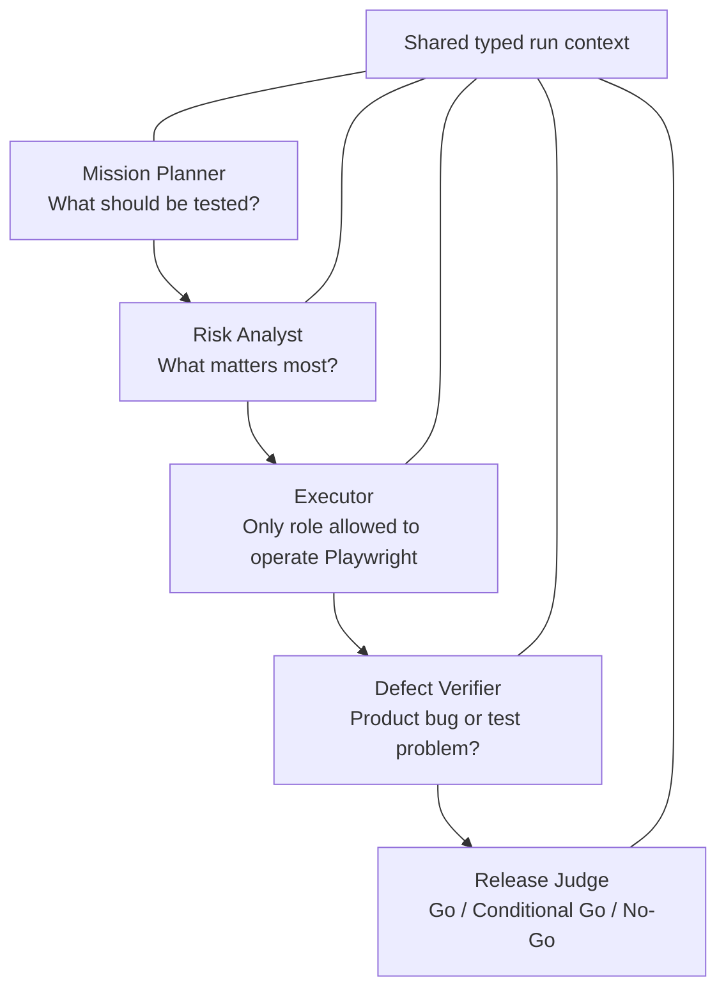
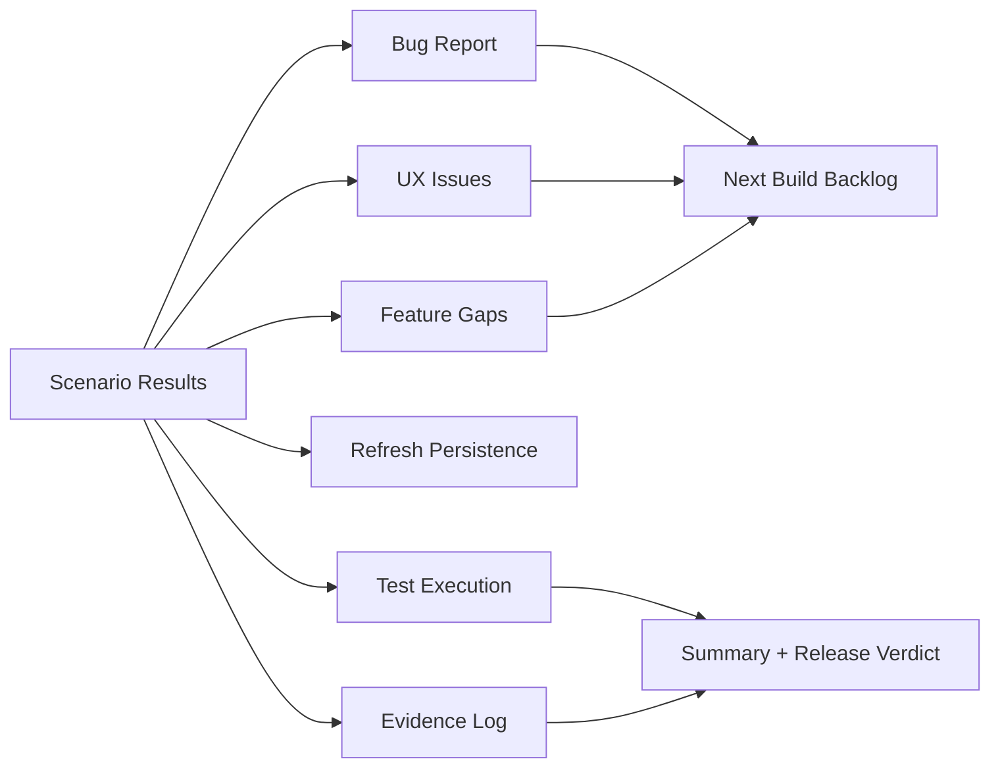
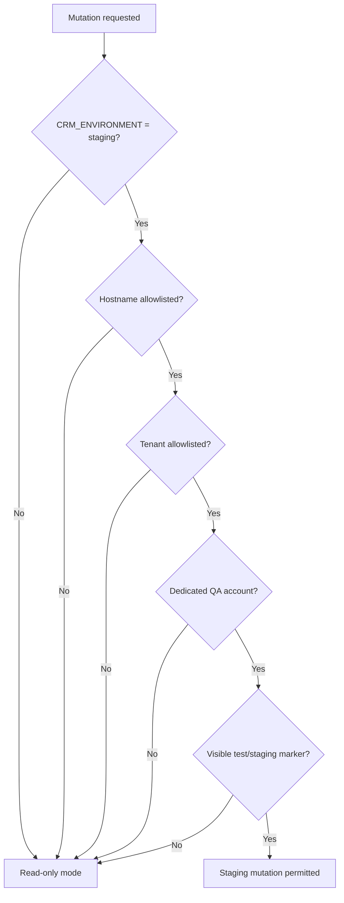

<div align="center">

# QaAgent-Pro

### Human-style, deterministic QA automation for modern CRM applications

[](https://github.com/BAKUGOS1/QaAgent-Pro/actions/workflows/quality.yml)
[](https://www.typescriptlang.org/)
[](https://playwright.dev/)
[](https://nodejs.org/)
[](LICENSE)
[](#quality-and-security)

**56 deterministic Leads scenarios · Excel reports with embedded screenshots · Risk-based testing · Independent defect verification · Staging-first safety**

[Quick start](#quick-start) · [How it works](#how-it-works) · [Reports](#excel-report) · [Safety](#safety-by-design) · [Roadmap](#roadmap)

</div>

---

QaAgent-Pro is a local-first TypeScript + Playwright QA system that approaches CRM testing like a careful human QA engineer:

- it starts with an explicit test mission;
- prioritizes by likelihood × business impact;
- applies experience-based testing heuristics;
- executes only registered deterministic actions;
- validates UI, network, persistence, search/table, console, accessibility, and performance evidence;
- independently decides whether a failure belongs to the application, automation, environment, or an unclear product rule;
- produces a stakeholder-ready Excel workbook.

It is intentionally **not** a random autonomous clicking agent.

## Why QaAgent-Pro?

Most browser agents optimize for completing a task. A QA system must do more: challenge assumptions, test negative paths, preserve evidence, distinguish test failures from product defects, disclose coverage gaps, and avoid damaging customer data.

QaAgent-Pro separates those responsibilities into explicit layers.

## How it works

```mermaid
flowchart LR
    M["QA Mission<br/>Given / When / Then"] --> P["Mission Planner"]
    P --> R["Risk Analyst<br/>Likelihood × Impact"]
    R --> H["Human-QA Heuristics<br/>Boundaries · Interruptions · Persistence"]
    H --> S{"Safety Gate"}
    S -->|"Verified staging"| E["Deterministic Executor"]
    S -->|"Gate failed"| RO["Read-only Audit"]
    E --> B["Playwright Browser Engine"]
    RO --> B
    B --> O["Multi-oracle Evidence"]
    O --> V["Independent Defect Verifier"]
    V --> J["Release Judge"]
    J --> X["Excel Report<br/>Screenshots + Evidence + Backlog"]
```



### Human-QA role model



The roles are deterministic TypeScript services—not external LLM agents. Codex is used to build, operate, and debug the repository, never to select arbitrary runtime clicks.

## Current capabilities

| Area | Capability |
|---|---|
| Leads coverage | 56 numbered scenarios with an independent result for every case |
| Blueprint conformance | Separates confirmed requirements, observed behavior, and product-confirmation questions |
| Functional testing | Validation, search, table, sorting, pagination, page size, detail and lifecycle contracts |
| Human-QA heuristics | Boundaries, interruptions, state transitions, data variation, error guessing and consistency |
| Non-functional testing | Responsive UI, accessibility basics and user-visible performance |
| Evidence | Screenshots, Playwright trace, console errors and action-scoped XHR/fetch evidence |
| Persistence | Reload, navigation and search/table verification |
| Safety | Environment, host, tenant, visible marker and dedicated-account gates |
| Reporting | Nine-sheet XLSX workbook with embedded screenshots |
| Quality | Strict TypeScript, ESLint, Vitest coverage, checksum verification and secret scanning |

## Three sources of truth

QaAgent-Pro never treats a design blueprint as the only truth:

1. **Confirmed blueprint requirements** — explicitly approved product expectations.
2. **Observed application behavior** — what the running application demonstrably does.
3. **Needs Product Confirmation** — behavior that is ambiguous, inferred, or conflicts with incomplete specifications.

This prevents missing features from being mislabeled as runtime bugs and prevents undocumented behavior from being silently accepted.

## Leads MVP

The Leads suite covers:

- authentication and page loading;
- blueprint controls;
- required, email, and mobile validation;
- valid creation and duplicate behavior;
- search by name, company, phone, and email;
- details and editable fields;
- notes and activities;
- safe Call, Email, and WhatsApp inspection;
- conversion, archive, read-only archive behavior, unarchive, and bulk archive;
- owner, label, city, activity-date, source, no-activity, overdue, and combined filters;
- sorting, pagination, page size, empty/no-results states;
- responsive UI, keyboard focus, accessible names, and performance;
- Import, Export, and Manage Columns conformance;
- persistence and cleanup reconciliation.

See the complete catalog in [docs/leads-test-plan.md](docs/leads-test-plan.md).

## Excel report

The user-facing deliverable is a single `.xlsx` workbook:

1. **Bug Report**
2. **Summary**
3. **UX Issues**
4. **Feature Gaps**
5. **Refresh Persistence**
6. **Next Build Backlog**
7. **Test Execution**
8. **Evidence Log**
9. **Run Metadata**



Failed findings can include embedded screenshots, reproduction steps, expected/actual behavior, risk score, oracle results, verification attribution, confidence, and release impact.

## Safety by design

Before any mutation, all gates must pass:



Blocked by default:

- production mutations;
- delete and destructive bulk operations;
- real email, WhatsApp, call, payment, billing, and invitation actions;
- sensitive exports;
- unrestricted crawling;
- arbitrary model-selected browser actions.

Credentials, auth state, reports, screenshots, traces, and local run data are Git-ignored.

## Quick start

### Requirements

- Node.js 20+
- npm
- Chromium installed through Playwright
- A dedicated QA account on a staging/test tenant

```bash
git clone https://github.com/BAKUGOS1/QaAgent-Pro.git
cd QaAgent-Pro
npm install
npx playwright install chromium
cp .env.example .env
```

Fill the local `.env` without committing it:

```dotenv
CRM_BASE_URL=https://your-staging-crm.example.com
CRM_EMAIL=qa@example.com
CRM_PASSWORD=
CRM_ENVIRONMENT=staging
CRM_TENANT=QA-TENANT
STAGING_HOST_ALLOWLIST=your-staging-crm.example.com
STAGING_TENANT_ALLOWLIST=QA-TENANT
QA_ACCOUNT_ALLOWLIST=qa@example.com
ALLOW_ARCHIVE=true
ALLOW_DELETE=false
ALLOW_DESTRUCTIVE=false
ALLOW_REAL_MESSAGES=false
ALLOW_SENSITIVE_EXPORT=false
```

Authenticate and execute:

```bash
npm run config:check
npm run auth:setup
npm run qa:leads
```

Debug with a visible browser:

```bash
npm run qa:leads -- --headed
```

Run only refresh/persistence scenarios:

```bash
npm run qa:refresh
```

Compile a deterministic Human-QA mission:

```bash
npm run qa:mission -- --file config/blueprint/sample-mission.json
```

## Commands

| Command | Purpose |
|---|---|
| `npm run auth:setup` | Login and save local Playwright storage state |
| `npm run qa:leads` | Execute all 56 Leads scenarios |
| `npm run qa:refresh` | Execute the refresh/persistence subset |
| `npm run qa:mission` | Validate and expand a deterministic QA mission |
| `npm run report:sample` | Generate a sample XLSX report |
| `npm run config:check` | Validate environment configuration without exposing secrets |
| `npm run test:unit` | Run framework unit tests with coverage |
| `npm run quality:gate` | Run the complete repository quality gate |

## Architecture

```text
src/
├── blueprint/     # Confirmed product requirements
├── browser/       # Auth, session, environment and evidence capture
├── config/        # Zod environment contract
├── data/          # Unique QA fixture factories
├── findings/      # Finding classification
├── human-qa/      # Missions, heuristics, risk, verification and release judgment
├── leads/         # 56-case scenario catalog, orchestrating runner, registry and contracts
├── pages/         # Playwright page objects
├── playbooks/     # Modular scenario playbooks per domain
│   └── leads/     # Edit, lifecycle, search, filters, quality, persistence, etc.
├── reporting/     # Excel workbook generation
├── safety/        # Environment and action authorization
└── shared/        # Logging, redaction, and cross-cutting utilities
```

Read the deeper [architecture](docs/architecture.md), [safety runbook](docs/safety-runbook.md), and [reference study](docs/reference-architecture-study.md).

## Quality and security

```bash
npm run quality:gate
npm audit --audit-level=moderate
```

The gate checks:

- approved product-input checksums;
- strict TypeScript;
- ESLint;
- unit tests and coverage;
- repository secret scan;
- workbook creation/reopening and embedded images;
- Playwright test discovery.

Current local validation: **61 tests passing, zero TypeScript errors, zero ESLint errors, zero npm audit vulnerabilities**.

## Research and inspiration

Concepts were studied—not blindly copied—from:

- [Microsoft Playwright](https://github.com/microsoft/playwright)
- [Agentic QE Fleet](https://github.com/proffesor-for-testing/agentic-qe)
- [Test Automation Skills & Agents](https://github.com/fugazi/test-automation-skills-agents)
- [GUITestBench / GUITester](https://arxiv.org/abs/2601.04500)
- [TestZeus Hercules](https://github.com/test-zeus-ai/testzeus-hercules) — AGPL concepts only; no code copied
- [BAKUGOS1/QaAgent](https://github.com/BAKUGOS1/QaAgent)

Exact reviewed revisions and licensing boundaries are documented in [docs/reference-architecture-study.md](docs/reference-architecture-study.md).

## Roadmap

- [x] Framework, safety and Excel foundations
- [x] Human-QA mission/risk/verification layers
- [x] Full 56-scenario Leads runner
- [x] Auth, evidence, persistence and cleanup contracts
- [x] Modular playbook architecture (edit, lifecycle, search, filters, quality, persistence)
- [x] Lifecycle contracts: convert-to-deal, archive, read-only, unarchive, bulk archive
- [x] Structured logging with secret redaction
- [ ] Stabilize CRM-owned test IDs for currently blocked selectors
- [ ] Deals pipeline and won/lost lifecycle
- [ ] Activities and Products modules
- [ ] Visual regression baselines
- [ ] CI staging execution with protected secrets
- [ ] Optional local intelligence for report synthesis—never browser action selection

## Contributing

Contributions are welcome. Read [CONTRIBUTING.md](CONTRIBUTING.md) and follow the architecture and safety constitution in [AGENTS.md](AGENTS.md).

## License

MIT © 2026 QaAgent-Pro contributors.
